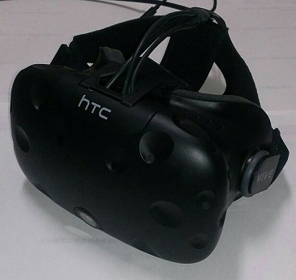
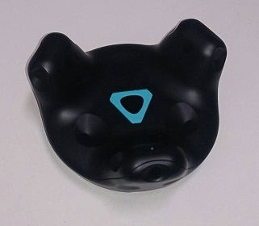

# ViveController-RTM-pkg

## 1. 概要
VRデバイスの1つであるHTC社のVIVEを対象として，その機能の簡易的な利用を可能にするRTコンポーネント群

## 2. 開発環境
### 2.1. 開発環境一覧
- PC：ZBOX-EN1070-U
- OS：Windows 10
- ソフトウェア：CMake / OpenRTM-aist-1.1.2-RELEASE
- ハードウェア：HTC VIVE / HTC VIVE トラッカー 2018
- 開発言語：C/C++

### 2.2. HTC VIVE / HTC VIVE トラッカー 2018
VRデバイスの1つであるHTC VIVEとHTC VIVE トラッカー 2018の機能について以下に示す．HTC VIVEにはヘッドマウントディスプレイ(以下，HMD)，コントローラ，ベースステーションが含まれている

### 2.2.1. HMD
ユーザーの頭の動きを反映し，ユーザーに画像を出力するデバイス  

### 2.2.2. コントローラ
ユーザーの手の動きを反映するデバイス．トリガーやパッドの機能が備わっている  

### 2.2.3. トラッカー
様々な場所に取り付け可能なトラッキング用のデバイス  

  
### 2.2.4. ベースステーション
HMD・コントローラ・トラッカーの位置姿勢を推定するデバイス  

## 3. 開発コンポーネントの概要
### [ViveController](https://github.com/Shogo-Yokoyama/ViveController-RTM-pkg/tree/master/RTC/ViveController)
本コンポーネントは以下の4つの機能をもつ  
- VIVEコントローラの位置姿勢/ボタン情報の管理   
- VIVE HMDの位置姿勢の管理
- VIVEトラッカーの位置姿勢の管理
- VIVE HMDへの画像の出力  
＊HMDへの映像表示は画像サイズや視差を考慮していないため不完全

### [SampleRobotController](https://github.com/Shogo-Yokoyama/ViveController-RTM-pkg/tree/master/RTC/SampleRobotController)
ViveControllerが取得した位置情報をPC画面上に表示するRTコンポーネント

### [ViveToVelocity](https://github.com/Shogo-Yokoyama/ViveController-RTM-pkg/tree/master/RTC/ViveToVelocity)
VIVEコントローラを用いて移動ロボットKobukiを操作するRTコンポーネント
コンフィグより以下の操作方法が利用できる  
- コントローラ上のパッドの接触位置に応じた操作
- コントローラの前後左右上下への動きに応じた操作

### [ViveCraneplusController](https://github.com/Shogo-Yokoyama/ViveController-RTM-pkg/tree/master/RTC/ViveCraneplusController)
VIVEコントローラを用いてロボットアームCRANE+を操作するRTコンポーネント  
コントローラの動きに応じたアーム先端の操作が可能

### [ViveSeednoidController](https://github.com/Shogo-Yokoyama/ViveController-RTM-pkg/tree/master/RTC/ViveSeednoidController)
VIVEデバイスを用いて双腕ロボットであるSEED-Noidを操作するコンポーネント  
今回は右腕の制御のみであり，左腕・頭部等の制御は今後にかけて実装する予定 　

## 4. マニュアル
[VIVEコンポーネント群マニュアル](https://github.com/Shogo-Yokoyama/ViveController-RTM-pkg/blob/master/ViveController-RTM-pkg_Manual.pdf)
  
### コンポーネントの作成・修正の度, 随時更新いたします
### 18年12月14日までの成果物のマニュアルの作成を急いで行ないます
